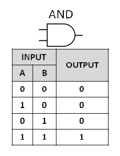
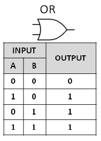
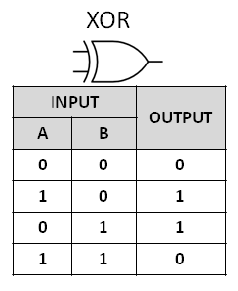

# Operações bit-a-bit

## And


```
10 & 3 = 2
00001010 & 00000011 = 00000010
```

## Or


```
10 | 7 = 15
00001010 | 00000111 = 00001111
```


## Xor


```
10 ^ 7 = 13
00001010 ^ 00000111 = 00001101
```

## Complemento

```
~10 = -11
~00001010 = 11110101

11110101 = -128 + 64 + 32 + 16 + 4 + 1 = -11
```

## Shift right

```
10 >> 1 = 5
00001010 >> 1 = 00000101
```

## Shift left

```
10 << 1 = 5
00001010 << 1 = 00010100
```